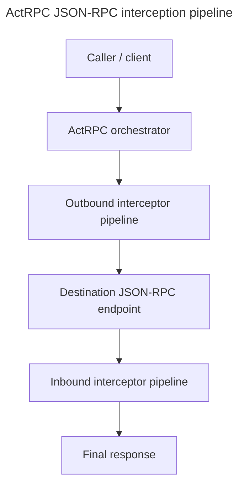

# ActRPC

ActRPC is a Rust workspace for orchestrated interception of JSON-RPC 2.0 calls.

It places an orchestrator between a caller and a destination JSON-RPC endpoint. The orchestrator runs outbound and inbound interceptor pipelines, lets interceptors request controlled actions, applies the allowed actions, forwards the call, and returns the final response.

## Workspace

| Crate                                        | Purpose                                                                                                                               |
| -------------------------------------------- | ------------------------------------------------------------------------------------------------------------------------------------- |
| [`actrpc-core`](crates/core)                 | Shared protocol model: JSON-RPC types, interception requests/responses, action records, descriptors, participants, and shared errors. |
| [`actrpc-core-macros`](crates/core-macros)   | Derive macros for value, parameter, and action-result descriptors.                                                                    |
| [`actrpc-orchestrator`](crates/orchestrator) | Runtime engine that runs interceptor phases, executes actions, forwards calls, and records transcript state.                          |
| [`actrpc-transport`](crates/transport)       | JSON-RPC client abstractions and concrete transports for stdio, TCP, local IPC, HTTP, and WebSocket targets.                          |
| [`actrpc-interceptor`](crates/interceptor)   | Interceptor-side helpers and bundled interceptor configuration models.                                                                |

## Pipeline

## How It Works

1. A caller issues a JSON-RPC method call.
2. The orchestrator creates an `InterceptionRequest` for the outbound phase.
3. Configured interceptors inspect the message and may request actions.
4. The orchestrator validates and executes allowed actions.
5. The call is forwarded to the destination endpoint.
6. The response is passed through the inbound interceptor pipeline.
7. Configured interceptors inspect the response and may request actions.
8. The final JSON-RPC response is returned to the caller.

## Built-in Action Families

`actrpc-orchestrator` includes built-in action handlers for common pipeline operations:

- calling configured methods
- excluding interceptors from the working pipeline
- reading the full interceptor catalog
- reading the working interceptor catalog
- reading the working pipeline
- reading the transcript
- modifying request params
- modifying success results
- modifying error responses
- rejecting a call
- request a review

## Transport Support

`actrpc-transport` provides client implementations and targets for:

- stdio
- TCP
- local IPC
- HTTP
- WebSocket

It also includes JSON-RPC stream framing support for content-length and newline-delimited messages.

## License

This project is licensed under either of:

- Apache License, Version 2.0 ([LICENSE-APACHE](LICENSE-APACHE) or https://www.apache.org/licenses/LICENSE-2.0)
- MIT license ([LICENSE-MIT](LICENSE-MIT) or https://opensource.org/licenses/MIT)

at your option.

### Contribution

Unless you explicitly state otherwise, any contribution intentionally submitted for inclusion in the work by you, as defined in the Apache-2.0 license, shall be dual licensed as above, without any additional terms or conditions.
