## Agentic Flow

### Concept

Agentify interceptors:

- call request done by the Origin
- outbound
  - detects if the message is directed to their corresponding agent by detecting an agreed template
  - appends premade instructions
- execution
- inbound
  - detects if the message contains any action requests like method calls.
  - makes the call
    - call goes through the same cycle (outbound, execution, inbound)
    - recieves the message after all phases are completed.
    - until it doesnt demand any other call it makes additional calls
  - modifies the message accordingly (clean final agent response)
- clean call response recieved by the Origin

### Actors

- User
- User CLI
- Orchestrator
- Interceptors
  - Agentifier (Planner)
  - Agentifier (Coder)
  - Agentifier (Git)
  - Firewall Router
- MCP Servers
  - LLM Completion
    - Tools
      - run_prompt (path)
  - File IO
    - Tools
      - read_file (path)
      - write_file (path, content)
  - Git
    - commit
    - diff
    - add

### Sequence Diagram

- REQ = JsonRPC 2.0 Request
- RSP = JsonRPC 2.0 Response

```mermaid
sequenceDiagram
    participant U as User
    participant C as UserCLI
    participant O as Orchestrator

    box rgb(255,200,255, 0.06) Interceptors
    participant F as Firewall Router
    participant AP as Agentifier (Planner)
    participant AC as Agentifier (Coder)
    participant AG as Agentifier (Git)
    end

    box rgb(255,200,255, 0.06) External Methods
    participant LLM as LLM Completion
    participant Git as Git Tools
    participant IO as FileIO
    end


    U-->>C: CLI Command

    C-->>O: REQ


    rect rgb(225,225,255,0.3)
    note right of O: Outbound Phase<br>Origin = User
    O-->>F: REQ
    F-->>O: RSP
    note over O,F: final = true, actions = [{action_name : disable_interceptors,<br> action_params : ..}]
    note over O,F: disables Planner and Coder because <br>Origin is User
    O-->>AP: REQ
    AP-->>O: RSP
    note over O,AP: final = true, actions = [{modify_params, action_params : ..}]
    note over O,AP: appends instructions for the llm to be planner
    end %% Outbound

    rect rgb(255,225,225,0.3)
    note right of O: Execution<br>Origin = User
    O-->>LLM: REQ
    LLM-->>O: RSP
    end

    rect rgb(225,255,225,0.3)
    note right of O: Inbound Phase<br>Origin = User
    O-->>F: REQ
    F-->>O: RSP
    note over O,F: final = true, actions = [{disable_interceptors,<br> action_params : ..}]
    note over O,F: disables Planner and Coder because <br> Origin is User and phase is inbound
    O-->>AP: REQ
    AP-->>O: RSP
    note over O,AP: final = false, actions = [{action_name: call_external_method, action_params: ..}]
    note over O,AP: llm response instructs to call Coder so it makes external_method_call and sets final to false to recall the Planner.

    rect rgb(225,225,255,0.3)
    note right of O: Outbound Phase<br>Origin = Planner Agent, Target LLM = Coder
    O-->>F: REQ
    F-->>O: RSP
    note over O,F: final = true, actions = [{action_name : disable_interceptors}]
    note over O,F: disables Planner because Origin is Planner
    O-->>AC: REQ
    AC-->>O: RSP
    note over AC,O: final = true, actions = [{action_name : modify_params, action_params : ..}]
    note over AC,O: appends instructions for the llm to be Coder
    O-->>AG: REQ
    AG-->>O: RSP
    note over AG,O: final = true
    end

    rect rgb(255,225,225,0.3)
    note right of O: Execution<br>Origin = Planner Agent, Target LLM = Coder
    O-->>LLM: REQ
    LLM-->>O: RSP
    end


    rect rgb(225,255,225,0.3)
    note right of O: Inbound Phase<br>Origin = Planner Agent, Target LLM = Coder
    O-->>F: REQ
    F-->>O: RSP
    note over O,F: final = true, actions = [{action_name : disable_interceptors}]
    note over O,F: disables Planner because Origin is Planner
    O-->>AC: REQ
    AC-->>O: RSP
    note over O,AC: final = false, actions = [{action_name: call_external_method, action_params: ..}]
    note over AC,O: calls File IO -> read_file_tree

    rect rgb(225,225,255,0.3)
    note right of O: Outbound Phase<br>Origin = Coder Agent, method = read_file_tree
    O-->>F: REQ
    F-->>O: RSP
    note over O,F: final = true, actions = [{action_name : disable_interceptors}]
    note over O,F: disables Planner, Coder, Git because Origin is Coder
    end

    rect rgb(255,225,225,0.3)
    note right of O: Execution<br>Origin = Coder Agent, method = read_file_tree
    O-->>IO: REQ
    IO-->>O: RSP
    end

    rect rgb(225,255,225,0.3)
    note right of O: Inbound Phase<br>Origin = Coder Agent, method = read_file_tree

    O-->>F: REQ
    F-->>O: RSP
    note over O,F: disables Planner, Coder, Git because Origin is Coder
    end

    O-->>AC: REQ
    AC-->>O: RSP
    note over O,AC: final = false, actions = [{action_name: call_external_method, action_params: ..}]
    note over AC,O: calls File IO -> read_file

    rect rgb(225,225,255,0.3)
    note right of O: Outbound Phase<br>Origin = Coder Agent, method = read_file
    O-->>F: REQ
    F-->>O: RSP
    note over O,F: final = true, actions = [{:ction_name = disable_interceptors}]
    note over O,F: disables Planner, Coder, Git because Origin is Coder
    end

    rect rgb(255,225,225,0.3)
    note right of O: Execution<br>Origin = Coder Agent, method = read_file
    O-->>IO: REQ
    IO-->>O: RSP
    end

    rect rgb(225,255,225,0.3)
    note right of O: Inbound Phase<br>Origin = Coder Agent, method = read_file
    O-->>F: REQ
    F-->>O: RSP
    note over O,F: final = true, actions = [{action_name : disable_interceptors}]
    note over O,F: disables Planner, Coder, Git because Origin is Coder
    end

    O-->>AC: REQ
    AC-->>O: RSP
    note over O,AC: final = true, actions = [{action_name: call_external_method, action_params: ..}]
    note over AC,O: calls File IO -> write_file

    rect rgb(225,225,255,0.3)
    note right of O: Outbound Phase<br>Origin = Coder Agent, method = write_file
    O-->>F: REQ
    F-->>O: RSP
    note over O,F: final = true, actions = [{action_name : disable_interceptors}]
    note over O,F: disables Planner, Coder, Git because Origin is Coder
    end

    rect rgb(255,225,225,0.3)
    note right of O: Execution<br>Origin = Coder Agent, method = write_file
    O-->>IO: REQ
    IO-->>O: RSP
    end

    rect rgb(225,255,225,0.3)
    note right of O: Inbound Phase<br>Origin = Coder Agent, method = write_file
    O-->>F: REQ
    F-->>O: RSP
    note over O,F: final = true, actions = [{action_name : disable_interceptors}]
    note over O,F: disables Planner, Coder, Git because Origin is Coder
    end

    end

    O-->>AP: REQ
    AP-->>O: RSP
    note over O,AP: final = false, actions = [{action_name: call_external_method, action_params: ..}]
    note over O,AP: llm response instructs for Git Agent to stage and run git diff and write a summary to inform the user about the changes.

    rect rgb(225,225,255,0.3)
    note right of O: Outbound Phase<br>Origin = Planner Agent, Target LLM = Git
    O-->>F: REQ
    F-->>O: RSP
    note over O,F: final = true, actions = [{action_name : disable_interceptors}]
    note over O,F: disables Planner because Origin is Planner
    O-->>AC: REQ
    AC-->>O: RSP
    note over AC,O: final = true
    O-->>AG: REQ
    AG-->>O: RSP
    note over AG,O: final = true, actions = [{action_name : modify_params, action_params : ..}]
    note over AG,O: appends instructions for the llm to be Git.
    end

    rect rgb(255,225,225,0.3)
    note right of O: Execution<br>Origin = Planner Agent, Target LLM = Git
    O-->>Git: REQ
    Git-->>O: RSP
    end


    rect rgb(225,255,225,0.3)
    note right of O: Inbound Phase<br>Origin = Planner Agent, Target LLM = Git
    O-->>F: REQ
    F-->>O: RSP
    note over O,F: final = true, actions = [{action_name : disable_interceptors}]
    note over O,F: disables Planner because Origin is Planner
    O-->>AC: REQ
    AC-->>O: RSP
    note over AC,O: final = true
    O-->>AG: REQ
    AG-->>O: RSP
    note over O,AG: final = false, actions = [{action_name: call_external_method, action_params: ..}]
    note over AG,O: calls Git -> add

    rect rgb(225,225,255,0.3)
    note right of O: Outbound Phase<br>Origin = Git Agent, method = git add
    O-->>F: REQ
    F-->>O: RSP
    note over O,F: final = true, actions = [{action_name : disable_interceptors}]
    note over O,F: disables Planner, Coder, Git because Origin is Git
    end

    rect rgb(255,225,225,0.3)
    note right of O: Execution<br>Origin = Planner Agent, Target LLM = Git
    O-->>Git: REQ
    Git-->>O: RSP
    end

    rect rgb(225,255,225,0.3)
    note right of O: Inbound Phase<br>Origin = Git Agent, method = git add
    O-->>F: REQ
    F-->>O: RSP
    note over O,F: final = true, actions = [{action_name : disable_interceptors}]
    note over O,F: disables Planner, Coder, Git because Origin is Git
    end

    O-->>AG: REQ
    AG-->>O: RSP
    note over O,AG: final = false, actions = [{action_name: call_external_method, action_params: ..}]
    note over AG,O: calls Git -> diff

    rect rgb(225,225,255,0.3)
    note right of O: Outbound Phase<br>Origin = Git Agent, method = git diff
    O-->>F: REQ
    F-->>O: RSP
    note over O,F: final = true, actions = [{action_name : disable_interceptors}]
    note over O,F: disables Planner, Coder, Git because Origin is Git
    end

    rect rgb(255,225,225,0.3)
    note right of O: Execution<br>Origin = Planner Agent, Target LLM = Git
    O-->>Git: REQ
    Git-->>O: RSP
    end

    rect rgb(225,255,225,0.3)
    note right of O: Inbound Phase<br>Origin = Git Agent, method = git diff
    O-->>F: REQ
    F-->>O: RSP
    note over O,F: final = true, actions = [{action_name : disable_interceptors}]
    note over O,F: disables Planner, Coder, Git because Origin is Git
    end

    O-->>AG: REQ
    AG-->>O: RSP
    note over O,AG: final = true, actions = [{action_name: modify_params, action_params: ..}]
    note over O,AG: modifies the response so that it have a properly structured summary of the modifications made by Coder Agent

    end

    O-->>AP: REQ
    AP-->>O: RSP
    note over O,AP: final = true, actions = [{action_name: modify_params, action_params : ..}]
    note over O,AP: modifies the response so that it informs the user about the work done by agents.

    end %% Inbound


    O-->>C: RSP
    C-->>U: CLI Response
```



### Messages

```json
{
  "jsonrpc": "2.0",
  "id": "1",
  "method": "intercept",
  "params": {
    "origin": {
      "type": "interceptor",
      "name": "planner_agent"
    },
    "message": {
      "method": "LLMrun_prompt",
      "params": {
        "path": "/secure/data.txt",
        "data": "hello"
      }
    }
  }
}
```

### Actions

```json
{
  "actions": [
    {
      "action": "disable_interceptors",
      "action_params": ["Planner Agent", "Coder Agent", "Git Agent"]
    }
  ]
}
```

```json
{
  "actions": [
    {
      "action": "call_external_method",
      "action_params": {
        "method_name": "git",
        "method_params": { "model_name": "model_0", "prompt": "<prompt>" }
      }
    }
  ]
}
```

```json
{
  "actions": [
    {
      "action": "call_external_method",
      "action_params": {
        "method_name": "run_prompt",
        "method_params": { "model_name": "model_0", "prompt": "<prompt>" }
      }
    }
  ]
}
```

```json
{
  "actions": [
    {
      "action": "disable_interceptors",
      "action_params": ["Planner Agent", "Coder Agent", "Git Agent"]
    }
  ]
}
```

```json
{
  "actions": [
    {
      "action": "modify_params",
      "action_params": {
        "messages": ["<appended system message>", "<original message>"]
      }
    }
  ]
}
```
