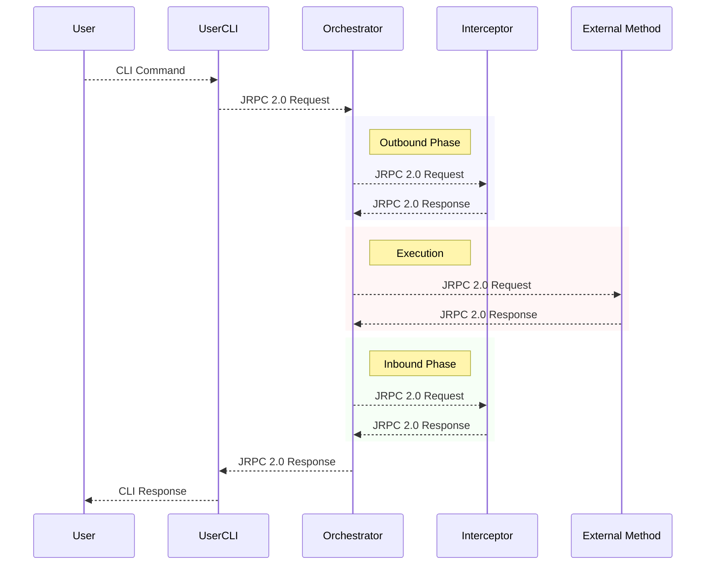

## Basic Flow

### Actors

- User
- User CLI
- Orchestrator
- Interceptor

### Sequence Diagram

```mermaid
sequenceDiagram
    participant U as User
    participant C as UserCLI
    participant O as Orchestrator
    participant I as Interceptor
    participant E as External Method
    U-->>C: CLI Command
    C-->>O: JRPC 2.0 Request

    rect rgb(225,225,255,0.3)
    note right of O: Outbound Phase
    O-->>I: JRPC 2.0 Request
    I-->>O: JRPC 2.0 Response
    end

    rect rgb(255,225,225,0.3)
    note right of O: Execution
    O-->>E: JRPC 2.0 Request
    E-->>O: JRPC 2.0 Response
    end

    rect rgb(225,255,225,0.3)
    note right of O: Inbound Phase
    O-->>I: JRPC 2.0 Request
    I-->>O: JRPC 2.0 Response
    end

    O-->>C: JRPC 2.0 Response
    C-->>U: CLI Response
```
